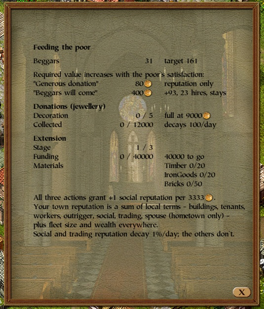

# mod-church-details

Fills the church window's empty starting page (selected page `-1`, the one the window
opens on) with what the church's three actions in that town are worth: **feeding the
poor**, **donating jewellery** and **funding the extension**.

Install: put `church_details.dll` into the `mods` folder (requires the modloader).



## Page contents

| row | what it says |
|-|-|
| Beggars | the pool now, and the equilibrium it drifts toward |
| Required value increases with the poor's satisfaction: | heading for the two replies below; the values also scale with the town's size (see the arithmetic) |
| "Generous donation" | the market value a gift must reach for the second reply. Reputation only |
| "Beggars will come" | the market value for the third reply, and **how many beggars the influx would actually add** - in hires, since four beggars make one - and how long they stay |
| Decoration | the 0..5 level the interior renders, and the jewellery money at which it saturates; gold past that buys reputation only |
| Collected | jewellery money against its cap; it decays 100 a day, so the decoration slides back unless topped up |
| Stage | extension stages built, out of three |
| Funding | the fund against the current stage's cost and what is still to go - or that the church is not accepting, is funded and waiting on materials, or is fully extended |
| Materials | the three wares the stage consumes, held against needed; they come from the town's own stock, so a funded extension stalls in a town short of bricks |
| All three actions grant ... | a closing paragraph: the goods value of one reputation point (the credit is linear and has no threshold), what your town reputation is made of and which of those terms are local, and which of them decay |

The influx row says what you would really get, not just "beggars":

- **`+72, 18 hires, stays`** - the normal case. The jump is
  `sqrt(citizens) / 6 + target / 2`; when it overshoots the pool's equilibrium the surplus
  drains back, and the note says for how long instead (`~12d`).
- **`no beggars - pool already full`** - once the town holds more than 50 beggars the jump
  is capped to keep them under a quarter of the population, and a town already at that
  quarter gets nothing. Below 50 the influx is uncapped, which is why a drained town is
  where the donation pays best.
- **`no beggars - town blocks growth`** - the town carries flag `0x8`, which blocks beggar
  growth outright. The influx tests `flags & 0x800008 == 0x800000`, so such a town gets
  nothing *and* does not consume the trigger bit.

**The values are market value at that town's own prices**, which is what the donation
dialog uses to price what you hand over - not base price. The town's selling-price routine
walks its price bands against current stock, so a ware the town is short of is worth far
more than its base: measured in Lübeck, beer priced at 2.7x base. `BASE_PRICE * 0.5` is
only the floor of that walk.

## Why the third band is worth aiming at

Beggars are the town's **labour pool**. Hiring converts four beggars into four poor
citizens, and a town with an empty pool cannot staff new buildings - it falls back to
poaching from existing ones. So the "beggars from everywhere will come" reply is not
flavour text, it is a workforce, and it is the only outcome a donation has beyond
reputation.

The pool has its own equilibrium, `sqrt(citizens * beggar_satisfaction / 2) / 3 + 8`, and
drifts toward it at up to `(sqrt(citizens) + 4) / 5` a day in and half that out - so the
influx is worth roughly a week of natural growth, delivered at once. Beggar satisfaction is
never lowered and repelling a siege raises it, so a town that has fought off attackers keeps
a permanently higher intake.

## The arithmetic

The reply comes from a gate byte the donation dialog computes as
`min(total_value / divisor, 255)`, with

```
divisor = trunc(sqrt(citizens * poor_satisfaction / 18)) + 8
```

banded at `< 10`, `10..49` and `>= 50`. A non-positive product never reaches the square
root, so the divisor floors at 8 - **a town whose poor are miserable is by far the cheapest
to impress**, and the cost scales with town size.

Reputation is separate and linear: `value * 0.0003`, credited to the merchant's *social*
term, which decays 1% per day. So donating is a top-up rather than a purchase, and there
is no bonus for making one large gift instead of several small ones - the bands only change
the reply and the beggars.

All of it lives in `p3-api`'s `town::church` module, including a unit test that reproduces
the one measured case (Lübeck, 3027 citizens, poor satisfaction 10 -> divisor 49 -> the
third band at 2450 gold, which was 53 barrels of beer in game).

## How the page is drawn

The church window is the same class family as the tavern's: vtable `0x00679A48`, and both
its per-frame update and its draw method load the page into `eax` with a 6-byte
`mov eax,[reg+0x1D30]` before dispatching through a jump table bounded by an **unsigned**
compare - so the `-1` the window opens on misses every case and nothing but the frame is
drawn. This mod detours both loads, does its work when the page is `-1`, and returns the
same page value in `eax`.

Both six-byte sequences are verified before anything is written, so a different game build
refuses to patch and `start()` fails loudly rather than corrupting code.
