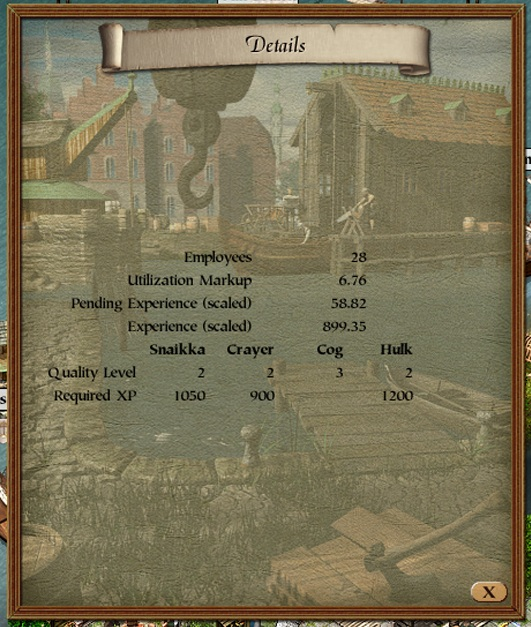

# mod-shipyard-details

Fills the shipyard window's empty starting page (selected page `-1`, the one the window
opens on) with the yard's figures the game shows nowhere.

Install: put `shipyard_details.dll` into the `mods` folder (requires the modloader).

## Page contents

| row | what it says |
|-|-|
| Employees | the shipyard facility's staff |
| Utilization Markup | the price factor the yard's workload currently puts on its work |
| Pending Experience (scaled) | experience earned but not yet applied, in levels (the raw value over 2800) |
| Experience (scaled) | the yard's experience, in levels |
| Quality Level | per ship type - Snaikka, Crayer, Cog, Hulk - the level the yard builds at now, out of 3 |
| Required XP | per ship type, the experience the next level needs; blank at the top level |

## How the page is drawn

The shipyard window (`p3_api::ui::ui_shipyard_window`) is the same class family as the
other building windows: its draw method loads the selected page with
`mov eax,[esi+0xC7C]` at `0x005F4320` and its update method at `0x005F4223`, both
followed by an unsigned compare that sends page `-1` past every case. `p3-ui`'s
`details_page_detours!` detours both loads, verifying the six bytes at each site first,
and hooks the window's open method.

The page is two `p3-ui` tables in the window's 20 px row pitch, under a "Details" title
banner drawn with the game's own title routine. The backdrop drawing state is the one every
details page uses, set on open and again before each draw.
