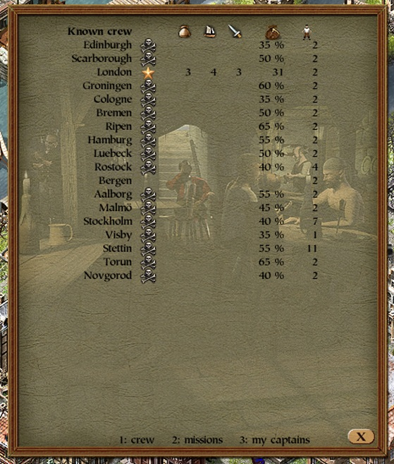
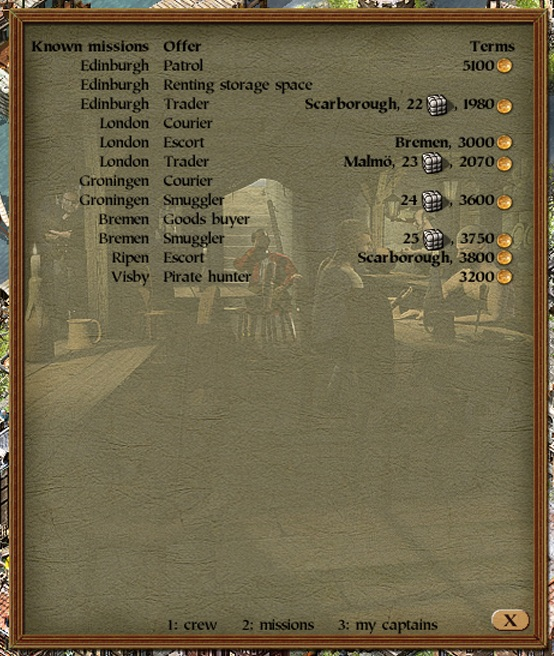
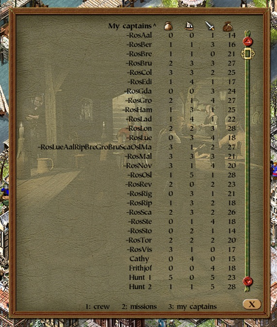

# mod-tavern-details

Fills the tavern window's empty starting page (selected page `-1`, the one the window
opens on) with the auto traders waiting to be hired, the way `mod-shipyard-details`,
`mod-town-hall-details` and `mod-trading-office-details` fill theirs.

Install: put `tavern_details.dll` into the `mods` folder (requires the modloader).

## Page contents

Three views, **1**, **2** and **3**.

1 - everyone a town has to hire, one row per man, headed by the game's own icons - the
three skill bonuses out of one sheet, the coin, the crew figure:

- **captains**: their navigation, trade and combat levels and their daily wage. A captain
  is listed while his record is chained to a town (that is where he sits) and no merchant
  employs him
- **pirates**, marked by the skull: the share of the loot they demand
  (`25 + 5 * ceil(field_8 / 32)` percent). Every town keeps one pirate record permanently,
  so this lists the pirate belonging to each town rather than the ones currently sitting in
  a tavern; pirates out sailing for a merchant drop off the list because their record
  leaves the town's chain. Their skill levels show only in the unrestricted view
- **sailors**, on the town's own row: the number the tavern itself works from,
  `0x004F6CA0` = `min(the player's sailor pool for that town, town + 0x2E4 - 1)`. Note that
  the tavern's own page caps what it offers at 50 unless `mod-tavern-show-all-sailors` is
  installed; this table shows the uncapped number

2 - the **missions** a side room offers, by town: the offer's title, the town a
transport order delivers to, the cargo it needs a ship for in loads, and what it pays -
or, for a treasure map, what it costs, with a minus in front of it.

Each of those comes out of the mission's own script, which is a file rather than code:
`missions_addon/*.p2m` inside `p2arch0_eng.cpr`, in the bytecode the letter-script
interpreter runs, named per script id by `scripts/missions_eng.ini`. `p3-api`'s `letters`
module says which variable each figure lives in and quotes the arithmetic. A patrol's
figure is the bonus per foiled ambush rather than a fee; a trader and a smuggler keep no
sum of their own, so theirs is the cargo times the rate their script pays on delivery (90
and 150); the courier works its pay out only when the voyage ends, so its cell stays
empty.

A smuggler's order names its destination only in the message that follows acceptance, so
the filtered view leaves that cell blank and only the unrestricted one fills it in.

3 - **my captains**: the player's own captained ships, one row per ship - its name, the
captain's trade, navigation and combat levels under the same icons, and his daily wage.
The fleet is the merchant's own ship chain (below), so convoy members and ships at sea
are included: a captain trains wherever his ship is. The table is sorted by name; a click
on a column header sorts by that column - names ascending, numbers descending - and a
second click reverses it, marked by a `^` or `v` beside the header. When the fleet has
more captains than the page has rows, the game's own scrollbar appears down the right
edge: its buttons, thumb and the mouse wheel over the table all work, because it is the
same `CP2Scrollbar` the ship overview uses, driven by the game (see below). **Alt+3** is
the same table with every skill written as `level/cap`, the cap being the ceiling of the
captain record's slot (`p3-api`'s `auto_trader::skill_caps` - it belongs to the slot, not
the man, so two captains at the same level can have different room to grow).

Views 1 and 2 cover the towns the player may legally enter, which is where he can hire:
the ones he has a trading office in, plus the ones one of his ships is in - including a
ship still entering the harbour, which is when the town becomes enterable and its tavern
reachable (ship status `<= 3`, town from the ship's `+0x39`).

The ship side walks the player's own ship chain (merchant record `+0xE` for the head,
ship `+0x4` for the next link), the way the game's per-merchant ship census at
`0x004F0AB1` does, so a world with a thousand ships in it costs no more than the
player's own fleet.

Each view has a plain and an alt variant: **1**/**2** list only the enterable towns and
only what the player could know, **Alt+1**/**Alt+2** every town in the game and everything
readable - a pirate's skills and a smuggler's destination appear only there - and **Alt+3**
adds the skill caps. The filtered headings say "Known crew/missions in town", since what
they list is what the player can see rather than what exists; the unrestricted ones drop
the word. The keys act on their down edge, so nothing has to be held, and the chosen view
survives closing and reopening the tavern. The page's bottom line names the three keys;
the alt variants are not advertised on the page.

The keys go through the shared hotkey registry (`hotkey_registry.dll`, see `mod-hotkey-registry`) and
are registered only while page `-1` is the one on screen - armed when the window opens
(it always opens on that page), disarmed the moment a tab is clicked (a detour on the
window's own page switcher, `0x005CED00`) and on close. They do nothing anywhere else,
and without the registry they are inert while the rest of the mod keeps working.

## How it works

The tavern window works like the other building windows: constructed once at startup
(constructor `0x005CB9B0`, called from the mass-constructor at `0x00426C2C`), its
object pointer kept in the static **`0x006E5574`**, its vtable at `0x00679B78` - draw
at `+0x9C` (`0x005CDC60`), per-frame update at `+0xF4` (`0x005CD540`), close at
`+0x118` (`0x005CD2A0`), open at `+0x120` (`0x005CC120`).

Both the draw and the update method load the selected page from `window + 0x1BF4` with
a 6-byte `mov eax, [reg+0x1bf4]` and dispatch through a jump table guarded by
`cmp eax, 0x11 / ja`, so page `-1` skips every page's drawing - and so both loads can
be detoured by replacing them with a jump that returns the same value in `eax`. (The
18 jump table entries are what the dispatch can reach, not what the window offers:
which pages have a tab depends on the game state - the captain and pirate pages, for
instance, only while one is available in that town.)

|Phase|Where|What for|
|-|-|-|
|open (`+0x120`)|vtable hook|set the class48 drawing state once, so the page's text is not clipped|
|update (`+0xF4`)|detour at `0x005CD54D`, continue `0x005CD553`|register the window's area as changed (`0x004B9650`) while the page is shown; keep the captains view's scrollbar attached, counted and polled|
|draw (`+0x9C`)|detour at `0x005CE3E0`, continue `0x005CE3E6`|render the page text|
|event (`+0x18`)|vtable hook|the widget event handler, `(point*, type)`; type `-2` is a left click, tested against the captains table's header cells|
|close (`+0x118`)|vtable hook|disarm the page keys, take the scrollbar down|

Beyond the addresses - the page field is `+0x1BF4`, the jump tables are `0x005CDBC8`
(update) and `0x005CE4F4` (draw) - nothing about the pattern differs from
`mod-trading-office-details`, which patches the same three phases on its own window.

Submitting the changed area matters: without it the page keeps showing older pixels
until something else submits the region (a mouse move over it, or alt-tabbing back
into the game). It has to happen in the **update** phase - calling it from inside the
draw method instead, whether once or on every frame, leaves the background art torn
and the text flickering.

The page draws no window title: the game's own page `-1` has none, and
`render_window_title` (`0x00420C70`) would spend the top of the window on the title
banner graphic, which the tables need for rows.

### The scrollbar

The captains view's bar is the game's `CP2Scrollbar` inside its list controller, through
`p3-api`'s `ui::scroll_list::ScrollList`. Windows and their sub-widgets are all direct
children of one flat root widget container, drawn and updated in registration order, so
the bar is registered there (`set_rect`, `0x00460EF0`, does that itself) *after* the
tavern window while view 3 is on screen and taken out (`0x00461480`) the moment the view,
the page or the window goes. The game then does the rest: the container draws it, drags
its thumb, and the container's mouse-wheel handler (`0x004B6A90`) feeds notches to the bar
whose catchment rect - the whole list area handed to `set_rect` - contains the cursor.
This mod only reads the first visible row back (`controller + 0x3A4`) and starts the table
there. The bar shows itself when the count exceeds the rows that fit; the table stops a row
short of the hint line so the bar clears the window's close button.
