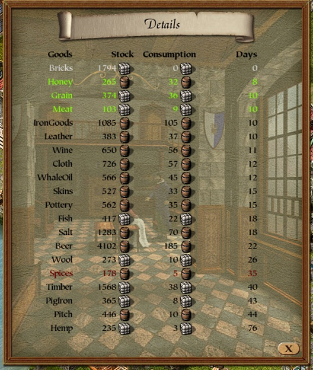
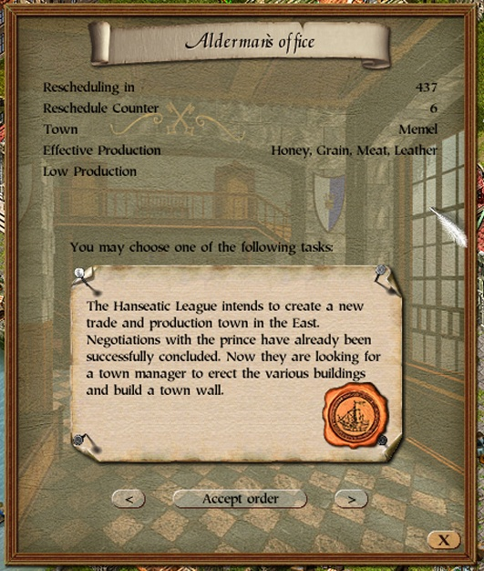

# mod-town-hall-details

Fills the town hall window's empty starting page (selected page `-1`, the one the window
opens on) with a Hanse-wide supply table, and adds a line of figures to the alderman's
office page (page 7) about the mission on offer.

Install: put `town_hall_details.dll` into the `mods` folder (requires the modloader).

## The Details page

The page the window opens on, titled "Details": one row per ware, for the whole Hanse.

|Column|What|
|-|-|
|Goods|the ware|
|Stock|every town's market stock plus every trading office's storage, in loads or barrels (the game's own unit symbol)|
|Consumption|the daily consumption of all citizens and businesses, town and office storages included|
|Days|how long the Hanse-wide stock lasts at that consumption|

Rows are sorted by days, scarcest first, and coloured:

- **grey** - consumption below one load or barrel a day, counted as nobody consuming it;
- **green** - the three shortest-supplied wares that are consumed, with meat and leather
  counted as one because a cattle farm produces both. These are the wares the Hanse needs
  most, which is what the game's new-settlement picker (`0x00532E30`) draws a founded
  town's production from;
- **dark red** - spices, which no town in the Hanse produces;
- black otherwise.

## The alderman's office page

Page 7 is the game's own alderman's office. While the player has no alderman mission
running and an offer is selected, the mod adds above the game's text:

- **Rescheduling in** - game ticks until the offer's scheduled task fires again (256 ticks
  to a day);
- **Reschedule Counter** - the task's counter, which the game raises by two each time it
  reschedules an offer nobody has taken;
- for a *found a new settlement* offer: the **town**, the settlement's **effective
  production** (the facilities that will work at full efficiency there; the fisherman's
  house reads as whale oil when the descriptor's `0x20000` bit is set), and the **low
  production** list.

## How it works

The town hall window is constructed once at startup and kept in the static `0x006E558C`
(see the gitbook's UI chapter). The open hook and the two page-load detours come from
`p3-page`'s `details_page_detours!`, which verifies the six bytes at each site before
writing; the page-switch hook is this mod's own:

|Phase|Where|What for|
|-|-|-|
|open (vtable `+0x120`)|vtable hook|set the class48 drawing state once, so the page's text is not clipped|
|page switch|call hook on the side panel's `set_selected_page` call at module offset `0x1A94BC`|re-apply the drawing state when the alderman's office (page 7) is selected|
|update (`+0xF4`, `0x005E0850`)|detour at `0x005E085B`, continue `0x005E0861`, where the update method loads the selected page|submit the window's area to the renderer (`0x004B9650`) on pages `-1` and 7, so the page does not keep stale pixels|
|draw|detour at `0x005E09AC`, continue `0x005E09B2`, where the draw method loads the selected page|render the Details page on `-1`, the extra lines on page 7|

Both pages are `p3-page` tables in the window's own 20 px row pitch: the Details page four
right-aligned columns with the game's load and barrel symbols in the stock and consumption
cells, the alderman's office a label/value pair per line.
